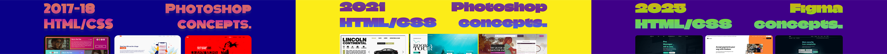
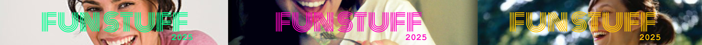
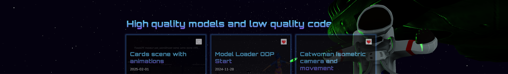

## `🤡 Hey! Don't you hate these Readmes? I do. So here is another. 🤡`

<!-- *disclaimer: WIP - the below sites need some bandwidth. also desktop is recommended because grow up and buy a PC.* -->
*Intro: I'm an oldschool nerd.* *---> Disclaimer: all work in progress -> kinda my yearly project to get my stuff together.*

### 👇 `Full-stack - Front-end - UI/UX - Paladin(⚒️⚒️⚒️).`
 <!-- - I'm an oldschool nerd. -->
 - Lots of repos, dumping shit all over the place. One day I'll sort them out, I promise.
 - Swearing in readmes and opening PRs on myself. As God intended GH to be used.

### 👇 `Front-end phases:`
- I love building stuff, no matter the stack really.
- I'm a part-time designer. I mainly design in CSS, code. Figma, PS on rainy days. Or for money.
>
> ---
>
> **[Phase 3](https://veryseriousbusiness.xyz/fend/phase3) - [Phase 2](https://veryseriousbusiness.xyz/fend/phase2) - [Phase 1](https://veryseriousbusiness.xyz/fend/phase1)** - P1 WARN: Gets quite cringe as we go back in time.
> 
> <a href="https://veryseriousbusiness.xyz/fend/">
> 
> 
></a>
>
> ---

### 👇 `Meme builds / Fun:`
- Social criticism, meme builds, and other stuff.
- Built strictly to offend others.
>
> ---
> **[Parallel Universe](https://veryseriousbusiness.xyz/kek/parallel-universe/)** - I ❤️ Recruiters. 
> **[Honest LinkedIn](https://veryseriousbusiness.xyz/kek/honest-linkedin)** - WIP.
> **[CringeAF consulting](https://veryseriousbusiness.xyz/xyzkh/heroes/cringeaf_base_hero/)** - WIP.
> 
> <a href="https://veryseriousbusiness.xyz/kek/">
> 
> </a>
>
> ---

### 👇 `Things:`
- I'm working on quick yearly recaps of my stuff, pretty much as a self reference to know what I wasted my life on.. so far.
>
> ---
> **[2024 - Summary](https://veryseriousbusiness.xyz/wrapped/2024/)** - 
> **[2023 WIP - Summary](https://veryseriousbusiness.xyz/wrapped/2023/)** - WIP - Low prio stuff.
> **[2022-20XX - Bulk](https://veryseriousbusiness.xyz/wrapped/bulk/)** - WIP - Low prio stuff.
> 
> <a href="https://veryseriousbusiness.xyz/wrapped/">
> 
> </a>
>
> ---

### 👇 `ThreeJS / JavaScript:`
 - I can design and build boring as fuck landing pages, but **[I prefer wasting time with these](https://birdonathree.com/three/projects/).**
 - Surprisingly enough, but after 30 I started enjoying Maths and basic Physics. Please send help.
 - Spent a few years with React. Got baited by the "it's just javascript bro" hype train back in 2016.
 - Back then I tried all the [next-nuxt-nixts](https://github.com/bembit/most-things-javascript-react-archive) of the Whatever.js ecosystem.
>
> ---
> **[birdonathree: demo site for my threeJS insanity](https://birdonathree.com/three/)** - I mean.. Anything is better than building another webshop. Even the unoptimized crap that eats 4.3GB of RAM. Front-end is so much easier when you mix webGL into it.
>
>
>
> - Temp. dump site for comps and heroes **[veryseriousbusiness/heroez/](https://veryseriousbusiness.xyz/heroez/)**
> - Temp. dump site for comps and heroes **[veryseriousbusiness/stuffz/](https://veryseriousbusiness.xyz/stuffz/)**
> ---

### 👇 `Contact, CV:`
- **[CV - done so many things in the past decades. WIP.](https://madbence.com/cv/profile/)**

> ---
> - hello@madbence.com 
> - [You can stalk me on LinkedIn.](https://linkedin.com/in/madbence)
> 
> ---

*- professional markdown designer*
