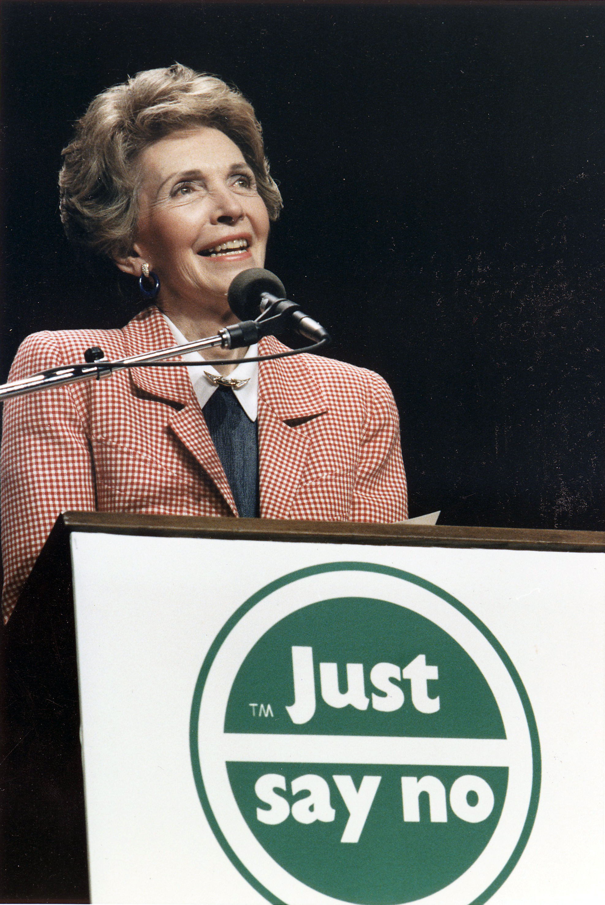

## Hey! Don't you hate these Readmes? I do. So here is another. 💯💯💯🤮💊❤️

*disclaimer: the below sites need some bandwidth. also desktop is recommended because grow up and buy a PC.*

### 👇 Intro:

I'm an oldschool nerd.

### Full-stack ➡️ Front-end ➡️ Vanilla everything enjoyer ➡️ Paladin ➡️ jQuery is enough
<!-- - I'm tired of frameworks and Disney movies. -->
- Front-end is easy. I design in CSS, code. Figma on rainy days.
- I enjoy building stuff, no matter the stack. 
- Lots of repos, dumping shit all over the place. One day I'll sort them out, I promise.
- Swearing in readmes and opening PRs on myself. As God intended GH to be used.
<!-- - canAdultForMoney(nineToFive) -->

### 🤦‍♀️ Things:

I'm working on quick yearly recaps of my stuff:
- [2024 - Wrapped](https://veryseriousbusiness.xyz/wrapped/2024/).
<!-- - [2023 - Wrapped](https://veryseriousbusiness.xyz/wrapped/2023/). -->

I really enjoy [ThreeJS](https://birdonathree.com/three/). Thinking of ways to make web2 great again. 

I can design and build [boring as fuck landing pages](https://veryseriousbusiness.xyz/xyzkh/heroes/cringeaf_base_hero/), but [I prefer wasting time with these](https://birdonathree.com/three/projects/).

<!-- Demo dump site [VerySeriousBusiness] -->
<!-- (https://veryseriousbusiness.xyz) -->

### 😒 & Stuff:

-  [CV - The road so far WIP](https://madbence.com/cv/profile/)
- hello@madbence.com
<!-- - [I despise LinkedIn but here it is](https://linkedin.com/in/madbence) -->

 

